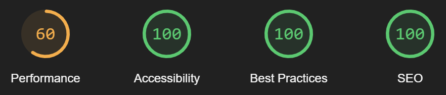

# my-website

My personal website, available here : https://marguerit.at/.

I made the first version of this project in 2017, using HTML and CSS with **Water.css** and **Netlify** as plateform.

For this second version, I used **NextJS**. With **Vercel** as plateform and **Cloudfare** as DNS.

Unit tests has been generated with IA (Claude 3.5 Sonnet).

## Built With

- NextJS
- Vercel
- TailwindCSS
- FlyonUI

## Performances

### Home, Career and Photos


### Map



Performance results are very inconsistent and bad with the “travel” page due to the map displaying hundreds of markers at the same time.

## How to use it

### Installation

```
git clone https://github.com/Gyskard/my-website
npm install
npx vercel env pull .env.development.local
```

Add a `RESUME_URL` key inside the file `.env.development.local`.
Add images in a vercel blob storage.

```
npm run dev
```

### Code quality

```
npm run lint
npm run format
```

### Test

```
npm run test
```
